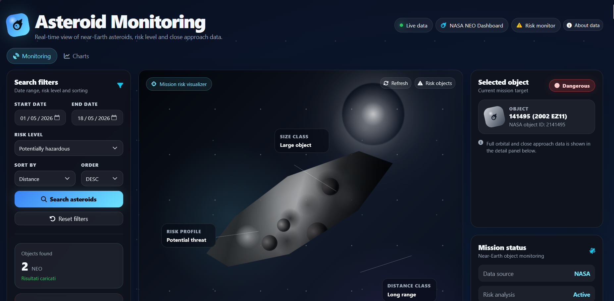
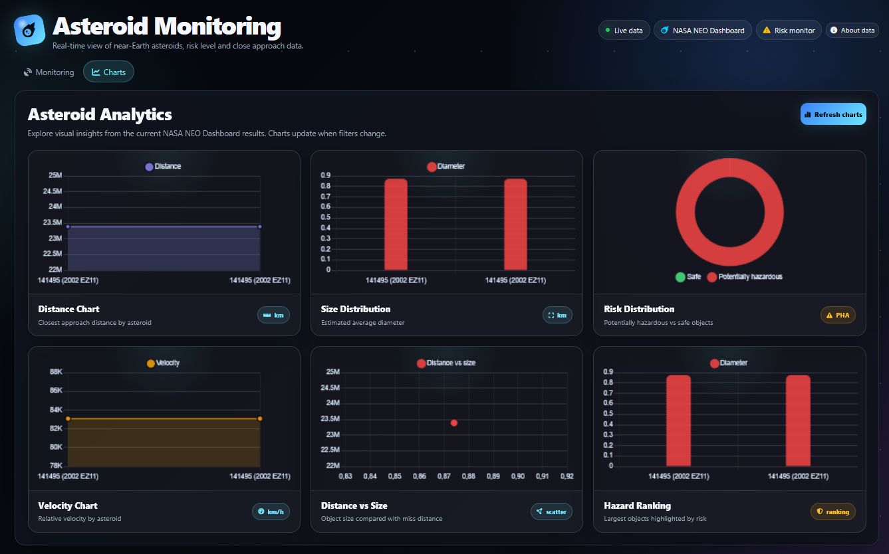
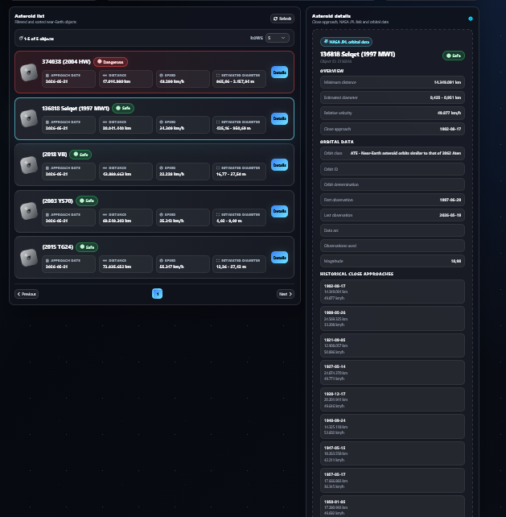
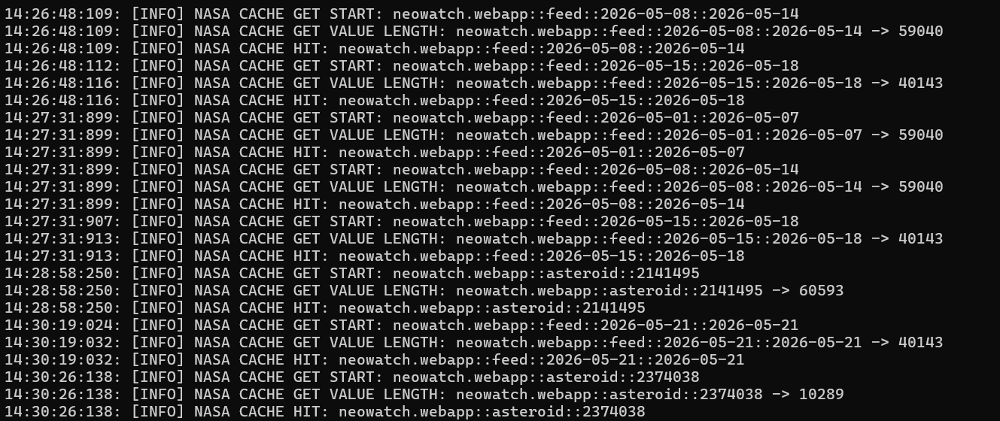

# Asteroid Monitoring Dashboard

A full-stack NASA NeoWs dashboard built with **Delphi 12 Community Edition**, **Horse**, **Sempare Templates**, **HTMX**, **Redis/Memurai**, **Chart.js** and a Clean Architecture approach.

The application monitors near-Earth objects using real NASA NeoWs data, provides filtering, asteroid details, charts, backend caching and a mission-style visualizer that translates asteroid data into a more intuitive risk profile.

This project was developed for the **NASA NEO Dashboard Challenge**.

---

## Live Demo

https://swirl-engraved-afterlife.ngrok-free.dev

The dashboard is publicly accessible through an ngrok HTTPS endpoint.

> Note: the demo is available while the Delphi backend and the ngrok tunnel are running.

---

## Screenshots

### Monitoring dashboard



### Charts



### Asteroid detail



### Backend cache hit logs



## Overview

This project is not only a NASA NEO Dashboard, but also a demonstration of how **Delphi** can be used to build a modern full-stack web application with:

- server-side rendering;
- backend proxying;
- NASA API caching;
- dynamic HTMX updates;
- chart visualization;
- Clean Architecture;
- MVC-style presentation layer;
- real NASA data.

The frontend never calls NASA directly.

All NASA requests go through the Delphi backend, which validates requests, manages cache, handles date range chunking and returns ready-to-render data to the dashboard.

---

## Main Features

- Real NASA NeoWs data.
- Backend proxy for NASA API requests.
- NASA API key hidden from frontend.
- Redis/Memurai server-side cache.
- Feed cache by date range.
- Asteroid detail cache by asteroid ID.
- Automatic date range chunking for ranges longer than 7 days.
- Search filters:
  - start date;
  - end date;
  - all objects;
  - potentially hazardous objects;
  - safe objects.
- Sorting:
  - distance;
  - estimated size;
  - ascending;
  - descending.
- Paginated asteroid list.
- Selected object panel.
- Full asteroid detail panel.
- NASA JPL link.
- Orbital data.
- Historical close approach data.
- Chart.js visualizations based on real backend data.
- Mission-style risk visualizer.
- SweetAlert2 validation for date range.
- Empty states and loading states.
- Duplicate asteroid detail requests prevention.
- Clean separation between templates, CSS and JavaScript.

---

## Tech Stack

### Backend

- Delphi 12 Community Edition
- Horse
- Sempare Template Engine
- Redis/Memurai
- Clean Architecture
- MVC-style presentation layer

### Frontend

- Sempare `.ejs` templates
- HTMX
- Bootstrap 5
- Font Awesome
- SweetAlert2
- Chart.js
- Custom CSS
- Custom JavaScript

### External API

- NASA API

---

## About the Stack Choice

This implementation uses **Delphi + Horse**. The challenge allows alternative technologies as long as the project remains solid, complete and easy to explain. This project follows that idea by using Delphi as a strongly typed backend platform while still providing a modern, dynamic and interactive web dashboard.
The backend exposes equivalent HTTP endpoints through Horse.

---

## Why Delphi

Although many dashboards are built with JavaScript or Python frameworks, this project intentionally uses **Delphi 12 Community Edition** to demonstrate that a modern full-stack web application can be built with a strongly typed, compiled backend.

The combination of Delphi, Horse, Sempare, HTMX and Redis/Memurai makes the application:

- lightweight;
- fast;
- maintainable;
- modular;
- strongly structured;
- suitable for backend-heavy dashboards.

This project shows that Delphi can be used not only for desktop or industrial applications, but also for modern web applications with real APIs, caching, dynamic UI and clean architecture.

---

## Template System

The UI is rendered using **Sempare Template Engine**.

The template files use the `.ejs` extension because the EJS-like syntax is supported by Sempare and provides a clean way to write dynamic HTML templates.

Example:

```html
<% if asteroids.Count > 0 %>
  <% for Asteroid in asteroids %>
    ...
  <% end %>
<% end %>
```

The project uses partial templates to keep the UI modular.

Example structure:

```text
Templates/
  Partials/
    Shared/
      Dashboard.ejs
    Monitoring/
      Monitoring.ejs
      AsteroidDetail.ejs
    Charts/
      charts.ejs
  static/
    css/
      dashboardstyle.css
    js/
      dashboard.js
    favicon.ico
```

---

## Architecture

The project follows **Clean Architecture** principles.

The application is separated into clear layers:

```text
Domain
  Entities
  Interfaces
  Business rules

Persistence
  NASA API gateway
  Redis/Memurai cache
  Repositories

Presentation
  Controllers
  Models
  Views
  DTOs
  Templates
```

This separation keeps the business logic independent from the web framework and external services.

---

## MVC-style Presentation Layer

On top of Clean Architecture, the presentation layer follows an MVC-style pattern.

### Controllers

Controllers handle HTTP routes and request flow.

Examples:

```text
GET /
GET /asteroids
GET /asteroids/{id}
```

### Models

Models prepare the data required by the views.

Examples:

```text
Monitoring model
Asteroid detail model
```

### Views

Views render the final HTML using Sempare templates.

Examples:

```text
Dashboard view
Monitoring view
Asteroid detail view
```

This approach keeps routing, data preparation and rendering separated.

---

## Backend Proxy

The frontend does not call NASA APIs directly.

All NASA requests are routed through the Delphi backend.

This allows the application to:

- hide the NASA API key;
- control request validation;
- centralize error handling;
- manage NASA rate limits;
- cache NASA responses;
- aggregate multiple NASA responses into one dashboard response.

Example flow:

```text
Browser
  -> Delphi Horse backend
    -> Cache check
      -> NASA API only if cache miss
    -> Response rendered with Sempare
  -> HTML returned to browser
```

---

## Cache Strategy

Caching is implemented with Redis/Memurai.

The backend stores NASA responses using structured cache keys.

### Feed cache

```text
neowatch.webapp::feed::{startDate}::{endDate}
```

Example:

```text
neowatch.webapp::feed::2026-05-01::2026-05-07
```

### Asteroid detail cache

```text
neowatch.webapp::asteroid::{id}
```

Example:

```text
neowatch.webapp::asteroid::2141495
```

---

## Cache Flow

First request:

```text
NASA CACHE MISS
NASA API request
NASA CACHE SET
Response returned to dashboard
```

Second request for the same range or asteroid:

```text
NASA CACHE HIT
Response served from backend cache
NASA API is not called again
```

Example log:

```text
NASA CACHE GET START: neowatch.webapp::feed::2026-05-01::2026-05-07
NASA CACHE GET VALUE LENGTH: neowatch.webapp::feed::2026-05-01::2026-05-07 -> 59040
NASA CACHE HIT: neowatch.webapp::feed::2026-05-01::2026-05-07
```

This reduces API usage, improves performance and helps avoid unnecessary NASA requests.

---

## Date Range Chunking

NASA supports a maximum range of 7 days per request.

To support larger user-selected ranges, the backend automatically splits the range into smaller chunks.

Example selected range:

```text
2026-05-01 -> 2026-05-19
```

Backend chunks:

```text
2026-05-01 -> 2026-05-07
2026-05-08 -> 2026-05-14
2026-05-15 -> 2026-05-19
```

Each chunk is cached independently.

Then the backend aggregates all results and returns one final response to the dashboard.

This allows the user to select flexible ranges while still respecting NASA API constraints.

---

## Filtering and Sorting

The dashboard supports filtering by:

- start date;
- end date;
- risk level:
  - all objects;
  - potentially hazardous;
  - safe.

Sorting options:

- distance;
- estimated size;
- ascending;
- descending.

The backend ensures that results outside the selected date range are not shown.

---

## Frontend Interactivity

The frontend uses **HTMX** to update parts of the page without a full reload.

HTMX is used for:

- applying asteroid filters;
- refreshing monitoring results;
- loading asteroid details;
- updating the asteroid list;
- refreshing chart data after filter changes.

This keeps the frontend simple while still providing a dynamic user experience.

---

## Charts

Charts are generated with **Chart.js** using real backend data.

The backend prepares a JSON payload for the frontend:

```html
<script type="application/json" id="asteroidChartData">
  ...
</script>
```

The JavaScript reads this JSON and renders charts.

Current chart types include:

- closest approach distance;
- estimated diameter ranking;
- risk distribution;
- velocity ranking;
- distance vs size;
- hazard ranking.

The chart data is generated from the current filtered asteroid results, so charts update after HTMX filter changes.

---

## Mission Risk Visualizer

The dashboard includes a custom **Mission Risk Visualizer**.

This is a visual component that translates NASA asteroid data into a more intuitive mission-style risk profile.

When an asteroid is selected, the visualizer updates based on real data:

- hazardous asteroids receive a stronger red glow;
- safe asteroids keep a cyan/neutral style;
- large objects appear visually bigger;
- high-speed objects get a more aggressive inclination;
- different asteroid IDs generate different silhouettes;
- distance influences visual intensity.

This makes the dashboard more engaging and helps users understand asteroid risk at a glance.

---

## Error Handling and UX

The application includes user-friendly validation and error handling.

### Date validation

If the start date is greater than the end date, the request is blocked and a SweetAlert2 message is shown.

### Range longer than 7 days

If the selected range is longer than 7 days, the UI explains that the backend will split it into cached chunks.

### Empty results

If no asteroids are found, the dashboard shows a clear empty state.

### Chart empty state

If there is no chart data, the charts section shows an empty state instead of rendering broken charts.

### Backend errors

If NASA or the backend fails, the UI can show an error message instead of breaking the page.

### Duplicate detail requests

The frontend avoids unnecessary repeated requests when the same asteroid detail is selected multiple times.

---

## Project Structure

Example structure:

```text
NEOWatch/
  Source/
    WebApp/
      Domain/
        Entities/
        Interfaces/

      Persistence/
        Gateways/
        Repositories/
        NasaCache/

      Presentation/
        Controllers/
        Models/
        Views/
          Templates/
            Partials/
              Shared/
                Dashboard.ejs
              Monitoring/
                Monitoring.ejs
                AsteroidDetail.ejs
              Charts/
                charts.ejs
            static/
              css/
                dashboardstyle.css
              js/
                dashboard.js
              favicon.ico

      NEOWatch.WebApp.dpr
      NEOWatch.WebApp.Registrations.pas
```

---

## Static Assets

Static assets are separated from templates.

```text
Templates/static/css/dashboardstyle.css
Templates/static/js/dashboard.js
Templates/static/favicon.ico
```

The dashboard imports them like this:

```html
<link href="/static/css/dashboardstyle.css" rel="stylesheet">
<script src="/static/js/dashboard.js"></script>
```

This keeps the main dashboard template clean and easier to maintain.

---

## Run Locally

### Requirements

- Delphi 12 Community Edition
- Redis or Memurai running locally
- NASA API key
- Internet connection
- Git

---

### 1. Clone the repository

```bash
git clone https://github.com/kleaturhani28/neo-watch-webapp
cd neo-watch-webapp
```

---

### 2. Start Redis/Memurai

Example using Memurai on Windows:

```bash
memurai-cli
PING
```

Expected result:

```text
PONG
```

---

### 3. Configure the application

Configure the required settings in the project configuration file.

Required values include:

```text
NASA_API_KEY=your_nasa_api_key
REDIS_HOST=localhost
REDIS_PORT=6379
```

The exact configuration format depends on the local `.ini` file used by the Delphi application.

The NASA API key must not be exposed in frontend JavaScript.

---

### 4. Build the project

Open the project in Delphi 12 Community Edition and build:

```text
NEOWatch.WebApp
```

---

### 5. Run the backend

The server starts on port `9000`.

Example output:

```text
Server is running on 0.0.0.0:9000
```

Open:

```text
http://localhost:9000
```

---

## Example Cache Test

Run the application and search a date range.

First request should show cache miss and cache set:

```text
NASA CACHE MISS: neowatch.webapp::feed::2026-05-01::2026-05-07
NASA CACHE SET START: neowatch.webapp::feed::2026-05-01::2026-05-07
```

Repeat the same search.

Second request should show cache hit:

```text
NASA CACHE HIT: neowatch.webapp::feed::2026-05-01::2026-05-07
```

This confirms that the backend cache is working correctly.

---

## API Routes

The suggested stack for the challenge was FastAPI, but this implementation uses Delphi + Horse.

The backend exposes equivalent HTTP endpoints through Horse.

---

### Dashboard

```text
GET /
```

Renders the main dashboard.

---

### Asteroid list

```text
GET /asteroids
```

Query parameters:

```text
startDate=YYYY-MM-DD
endDate=YYYY-MM-DD
hazardous=all|dangerous|safe
sortBy=distance|size
sortDirection=asc|desc
```

Example:

```text
GET /asteroids?startDate=2026-05-01&endDate=2026-05-16&hazardous=all&sortBy=distance&sortDirection=asc
```

---

### Asteroid detail

```text
GET /asteroids/{id}
```

Example:

```text
GET /asteroids/2141495
```

---

## Deployment

The application is currently exposed online through **ngrok** for the challenge delivery.

Public dashboard:

```text
https://swirl-engraved-afterlife.ngrok-free.dev
```


The application is a Delphi Horse full-stack web application.

The Delphi backend serves both:

- the server-rendered frontend pages;
- the backend API routes used by the dashboard.

The backend runs on port 9000, while ngrok forwards the public HTTPS URL to the Delphi Horse backend.

```text
Public browser
  -> https://swirl-engraved-afterlife.ngrok-free.dev
    -> ngrok HTTPS tunnel
      -> Delphi Horse backend on port 9000
        -> Redis/Memurai cache
        -> NASA NeoWs API
```

The NASA API key is configured only on the backend side and is never exposed in frontend JavaScript.

For the challenge delivery, this setup provides a public URL that can be opened from any browser without login.

Note: the ngrok endpoint requires both the Delphi backend process and the ngrok tunnel process to remain active.

---

## Why ngrok was used for the public demo

The challenge requires the dashboard to be reachable online from any browser without login.

This project is implemented as a **Delphi Horse full-stack web application**, where the same backend serves both:

- the server-rendered frontend;
- the backend API endpoints used by the dashboard.

Because the application is currently built as a Windows Delphi executable, deploying it to typical Linux-based platforms such as Railway, Render or Fly.io would require additional infrastructure work, such as Linux compilation or Windows container hosting.

For the challenge delivery, **ngrok** was selected as a practical solution to expose the working Delphi backend through a public HTTPS URL.

This allows the project to provide:

- a public demo URL;
- HTTPS access;
- no login required for visitors;
- backend proxy behavior preserved;
- NASA API key kept only on the backend side;
- no NASA API key exposed in frontend JavaScript.

This setup was chosen to make the project publicly testable while keeping the original Delphi architecture intact.

A future production deployment could use a Windows VPS, a custom domain and an HTTPS reverse proxy for permanent hosting.
---

## Environment Variables / Configuration

Recommended configuration values:

```text
NASA_API_KEY=your_nasa_api_key
NASA_BASE_URL=https://api.nasa.gov/neo/rest/v1
REDIS_HOST=localhost
REDIS_PORT=6379
CACHE_TTL_FEED_SECONDS=21600
CACHE_TTL_DETAIL_SECONDS=86400
APP_PORT=9000
```

The NASA API key should never be exposed in frontend JavaScript.

---

## Challenge Highlights

This project includes the main requirements expected from a strong NASA NeoWs dashboard challenge submission:

- backend proxy;
- NASA API key hidden from frontend;
- Redis/Memurai cache;
- feed cache;
- asteroid detail cache;
- arbitrary date range support;
- automatic 7-day chunking;
- filters and sorting;
- paginated asteroid list;
- asteroid detail panel;
- real NASA orbital data;
- charts based on real backend data;
- clear loading and empty states;
- SweetAlert2 validation;
- custom mission risk visualizer;
- Clean Architecture;
- MVC-style presentation layer;
- static asset separation;
- ready for deployment behind a reverse proxy.

---

## Author

Developed by **Klea Turhani**.

Software Developer  
Built with Delphi, Horse, Sempare, HTMX and Redis/Memurai.
